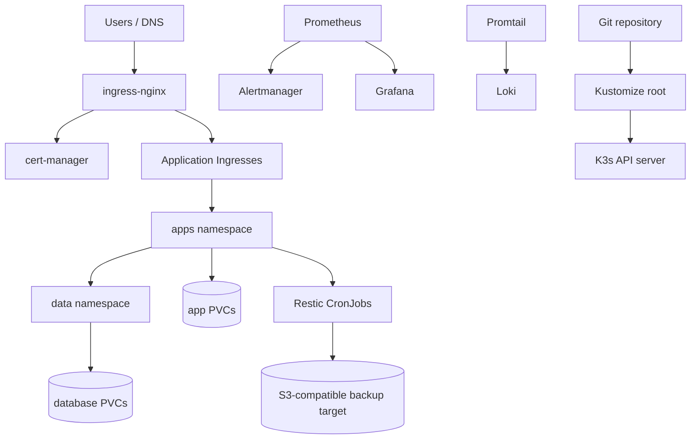

# ITO K3s Production Platform

Production-oriented Kubernetes configuration for a small server platform built on K3s.

This repository is meant to be a ready server config set: the cluster foundations, application manifests, network boundaries, encrypted secret workflow, backups, telemetry, validation scripts, and runbooks live together and render from one Kustomize entrypoint.

It is sanitized. It does not contain real production secrets, kubeconfig, TLS private keys, database dumps, or generated runtime files.

## What This Repository Is

This is not only a collection of app YAML files. It is an opinionated operating model for running a small production K3s server:

- install K3s with bundled Traefik disabled.
- use ingress-nginx as the HTTP/S edge.
- use cert-manager for ACME certificate lifecycle.
- keep runtime secrets encrypted in Git with SOPS + Age.
- deny ingress and egress by default, then allow only documented paths.
- back up databases and PVC content off-node with Restic.
- collect metrics and logs with a lightweight telemetry stack.
- alert on pod, PVC, node disk, and backup failures.
- document restore, rollback, rotation, and validation procedures.

The repo is production-oriented, not production-magic. It still requires real DNS, real encrypted secrets, a real alert receiver, an offsite backup target, and a restore drill before cutover.

## Current Capability

| Area | Included |
| --- | --- |
| Cluster bootstrap | K3s install script, Traefik disabled, Helm add-on install for ingress-nginx and cert-manager |
| Ingress | ingress-nginx values, per-app Ingress objects, TLS annotations, admin allowlists and rate limits |
| TLS | cert-manager `ClusterIssuer` manifests for staging and production Let's Encrypt |
| Secrets | SOPS + Age production flow, plaintext examples, ignored local plaintext, break-glass `.env` path |
| Storage | retained `local-path` StorageClass and PVCs for stateful apps |
| Backups | Restic CronJobs for DB dumps and PVC content backups to S3-compatible storage |
| Restore | guarded PVC restore helper plus WordPress and Passbolt restore runbooks |
| Telemetry | Prometheus, Alertmanager, kube-state-metrics, node-exporter, Grafana, Loki, and Promtail |
| Alerts | baseline alert rules for failed backups, stale backups, crash loops, PVCs, targets, and root disk |
| Network | default-deny ingress/egress with per-app policies for ingress, DB, DNS, web, SMTP, Jenkins SSH, and backups |
| Runtime hardening | service accounts, disabled token automount where possible, resource requests/limits, quotas, non-root contexts |
| Supply chain | pinned image tags with SHA256 manifest digests for app and platform workloads |
| Operations | Make targets, validation scripts, production gate checks, runbooks, docs, GitOps notes |

## Applications

| App | Public surface | Stateful data | Notes |
| --- | --- | --- | --- |
| WordPress demo | yes | MySQL PVC and content PVC | Bitnami non-root WordPress image, DB and content backup coverage |
| Jenkins | admin | Jenkins home PVC | Ingress allowlisted, TCP 50000 agent policy |
| GLPI | admin | app data PVC | Ingress allowlisted, backup coverage for PVC content |
| Superset | admin | Superset home PVC | Ingress allowlisted, admin bootstrap secret documented for rotation |
| Passbolt | admin | MariaDB PVC and Passbolt data PVC | DB and key/data restore runbook |
| Portainer | admin | Portainer data PVC | Ingress allowlisted, bootstrap hash stored as Secret |

Admin tools are intentionally not treated like public websites. They need IP allowlisting at minimum, and preferably VPN or external auth before production exposure.

## Architecture



## Repository Layout

| Path | Purpose |
| --- | --- |
| `kustomization.yaml` | Root Kustomize entrypoint for the full rendered server state |
| `platform/` | Namespaces, settings, service accounts, storage, quotas, backups, telemetry, Helm values |
| `policies/` | Default-deny and least-privilege NetworkPolicies |
| `apps/` | Application Deployments, Services, Ingresses, PVCs, and secret references |
| `secrets/` | SOPS secret workflow documentation and sanitized examples |
| `scripts/` | Bootstrap, apply, validation, secret, readiness, and restore helpers |
| `docs/` | Architecture, security, operations, GitOps, validation, decisions, and presentation docs |
| `runbooks/` | Incident and maintenance procedures |

## Prerequisites

Local operator machine:

- `kubectl`
- `helm`
- `sops`
- `age`
- `make`
- access to the target server over SSH
- kubeconfig for an existing cluster, or permission to bootstrap K3s

Target server:

- Linux host suitable for K3s.
- public IP and DNS records for the app hostnames.
- inbound HTTP/HTTPS allowed to ingress-nginx.
- outbound HTTPS to the S3-compatible backup target.
- enough disk for local PVCs, Prometheus, Loki, Grafana, and app data.

## Production Setup

1. Create production secrets locally from the sanitized example:

```bash
cp secrets/production.plain.example.yaml secrets/production.plain.yaml
vim secrets/production.plain.yaml
```

Replace every placeholder. The file must include app secrets, backup repository credentials, Grafana admin credentials, and `alertmanager-secret` with a real receiver.

2. Encrypt secrets with SOPS + Age:

```bash
export SOPS_AGE_RECIPIENTS=age1...
make encrypt-secrets
```

Commit only `secrets/production.enc.yaml`. The plaintext `secrets/production.plain.yaml` is ignored and must stay local.

3. Replace every value in `platform/settings.yaml`:

```yaml
letsencryptEmail: ops@example.com
wordpressHost: wp.example.com
jenkinsHost: jenkins.example.com
glpiHost: glpi.example.com
supersetHost: bi.example.com
passboltHost: passbolt.example.com
passboltBaseUrl: https://passbolt.example.com
portainerHost: portainer.example.com
adminWhitelistSourceRange: 198.51.100.10/32
```

Use a real operator IP or VPN CIDR for `adminWhitelistSourceRange`. Do not use `0.0.0.0/0` for admin apps.

4. Bootstrap and install platform add-ons:

```bash
make bootstrap
export KUBECONFIG=$PWD/kubeconfig
make addons
```

For an existing K3s cluster, skip `make bootstrap` and export the correct `KUBECONFIG`.

5. Validate, apply secrets, and apply manifests:

```bash
make check
make secrets
make production-check
kubectl diff -k .
make apply
make validate
```

`make apply` refuses example domains, `admin@example.com`, TEST-NET allowlist IPs, and public admin allowlists unless `ALLOW_EXAMPLE_VALUES=true` is set for non-production testing.

## Daily Operations

Common checks:

```bash
kubectl get nodes -o wide
kubectl get pods -A
kubectl get ingress -A
kubectl get certificates -A
kubectl -n apps get cronjob
kubectl -n ops get deploy,ds,svc,pvc
```

Render and static-check the repo:

```bash
make check
kubectl kustomize . >/tmp/ito-k3s-rendered.yaml
```

Review changes before applying:

```bash
kubectl diff -k .
make apply
make validate
```

## Backup And Restore

Backups are defined as Kubernetes CronJobs:

- database dumps: [platform/backups/database-backups.yaml](platform/backups/database-backups.yaml)
- PVC content backups: [platform/backups/volume-backups.yaml](platform/backups/volume-backups.yaml)

Run a manual backup:

```bash
kubectl -n apps create job --from=cronjob/backup-wordpress-db backup-wordpress-db-manual
kubectl -n apps logs -f job/backup-wordpress-db-manual
```

Restore PVC content with the guarded helper:

```bash
RESTORE_TAG=wordpress-content TARGET_PVC=wordpress-content CONFIRM_RESTORE=yes make restore-volume
```

Application restore runbooks:

- [Restore WordPress](runbooks/RESTORE_WORDPRESS.md)
- [Restore Passbolt](runbooks/RESTORE_PASSBOLT.md)

Do not count the platform as production-ready until at least one DB restore and one PVC restore have been tested from the offsite Restic repository.

## Observability

The telemetry stack lives under `platform/telemetry/`:

- Prometheus scrapes Kubernetes pods, kube-state-metrics, node-exporter, and itself.
- Alertmanager receives alerts from Prometheus using encrypted receiver config from `alertmanager-secret`.
- Grafana provisions Prometheus, Loki, and Alertmanager data sources.
- Loki stores logs.
- Promtail ships node pod logs from `node-observability`.
- node-exporter exposes host metrics, including root disk capacity.

Validate alerting:

```bash
kubectl -n ops get deploy prometheus alertmanager grafana
kubectl -n ops logs deploy/prometheus --tail=100
kubectl -n ops logs deploy/alertmanager --tail=100
```

The example Alertmanager config points at a placeholder webhook. Replace it before production and send a test alert to prove delivery.

## Security Model

The repository uses several layers together:

- SOPS + Age for committed production Secrets.
- no plaintext production Secret values in tracked files.
- admin ingress source allowlists and rate limits.
- default-deny NetworkPolicies for `apps` and `data`.
- narrow app-to-database and backup-to-database policies.
- explicit DNS, web, SMTP, S3, and Jenkins Git SSH egress policies.
- service accounts per workload.
- disabled service account token automount where the workload does not need Kubernetes API access.
- Pod Security Admission labels on namespaces.
- image digests to reduce tag drift.
- render and production-readiness checks in scripts.

Vanilla Kubernetes NetworkPolicy cannot enforce FQDN egress. A Cilium example is provided in [policies/examples/cilium-fqdn-egress.example.yaml](policies/examples/cilium-fqdn-egress.example.yaml) for a future stricter egress model.

## Make Targets

| Target | Purpose |
| --- | --- |
| `make bootstrap` | Install K3s on the current Linux node |
| `make addons` | Install ingress-nginx and cert-manager with Helm |
| `make encrypt-secrets` | Encrypt `secrets/production.plain.yaml` into `secrets/production.enc.yaml` |
| `make secrets` | Apply SOPS-encrypted Kubernetes Secrets |
| `make local-secrets` | Break-glass Secret creation from `.env` |
| `make check` | Render manifests and run static repository checks |
| `make production-check` | Run structural production readiness checks; set `REQUIRE_REAL_PRODUCTION_VALUES=true` for cutover gates |
| `make diff` | Show the Kustomize diff |
| `make apply` | Apply platform and app manifests |
| `make validate` | Run cluster validation checks |
| `make restore-volume` | Create a guarded Restic restore Job for a PVC |

## Production Gate

Before cutting over a real hostname, prove these:

- `platform/settings.yaml` contains real domains, email, and admin allowlist CIDR.
- `secrets/production.enc.yaml` exists, decrypts, and is committed.
- `make check` passes.
- `make production-check` passes, and `REQUIRE_REAL_PRODUCTION_VALUES=true make production-check` passes before cutover.
- `make secrets` has applied required runtime Secrets.
- `kubectl diff -k .` has been reviewed.
- cert-manager can issue the relevant certificate.
- NetworkPolicy enforcement works on the server CNI.
- the app has a successful backup and restore drill.
- Alertmanager routes a test alert to the operator.
- DNS rollback is documented.
- admin surfaces are protected by allowlist plus app auth, VPN, or external auth.

## Documentation Index

- [Architecture](docs/ARCHITECTURE.md)
- [Operations](docs/OPERATIONS.md)
- [Security](docs/SECURITY.md)
- [Application Mapping](docs/APP_MAPPING.md)
- [Architecture Decisions](docs/DECISIONS.md)
- [GitOps Model](docs/GITOPS.md)
- [Production Readiness](docs/PRODUCTION_READINESS.md)
- [Validation Guide](docs/VALIDATION.md)
- [Server Config Set](docs/SERVER_CONFIG_SET.md)
- [Implementation Notes](docs/IMPLEMENTATION_NOTES.md)
- [Runbooks](runbooks/README.md)

## What Is Still Operator-Owned

This repo cannot supply:

- real DNS records.
- real Age recipients and private key custody.
- real S3 credentials and backup retention policy.
- real Alertmanager receiver endpoints.
- real admin access policy.
- real restore drill evidence.
- vulnerability scanning and image update cadence.
- external auth provider configuration.
- HA decision for the K3s control plane and storage layer.
- multi-cluster overlays; the current entrypoint is the repository root.

Those are production facts, not reusable sanitized config.

## Safety Rules

- Do not commit `.env`.
- Do not commit `secrets/production.plain.yaml`.
- Do not commit kubeconfig files.
- Do not commit generated TLS material.
- Do not commit database dumps.
- Do not apply with example domains.
- Do not expose admin tools to the whole internet.
- Do not treat local-path PVCs as backups.
- Do not rotate bootstrap Secrets and assume initialized apps changed internally. Use [Secret Rotation](runbooks/SECRET_ROTATION.md).
