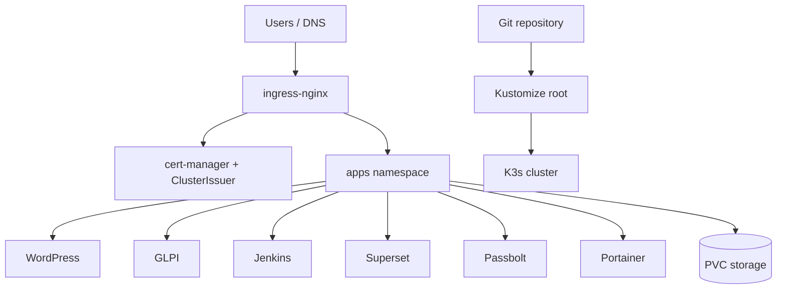

# ITO K3s Production Platform

This repository contains production-oriented Kubernetes/K3s configuration for the ITO server platform. It is designed as a ready config set for small VPS or bare-metal servers that need explicit Kubernetes primitives: namespaces, ingress-nginx, cert-manager, NetworkPolicy, PVCs, resource guardrails, probes, pinned images, and repeatable runbooks.

The repository is sanitized. It contains no real production secrets, kubeconfig, certificate private keys, database dumps, or generated environment file.

## What This Provides

- K3s bootstrap with bundled Traefik disabled.
- ingress-nginx as the public HTTP/S edge.
- cert-manager ClusterIssuers for ACME certificates.
- central public settings in `platform/settings.yaml`.
- default-deny ingress and egress NetworkPolicies.
- per-app ingress, database, DNS, web, SMTP, and Jenkins Git egress policies.
- dedicated service accounts with token automount disabled.
- resource requests, limits, ResourceQuotas, and LimitRanges.
- pinned image tags with manifest digests for application containers.
- operational scripts and runbooks for apply, validation, rollback, and troubleshooting.

## Architecture



## Repository Layout

| Path | Purpose |
| --- | --- |
| `kustomization.yaml` | Root Kustomize entrypoint for the server config set. |
| `platform/` | Namespaces, runtime settings, service accounts, storage, ingress-nginx values, cert-manager values, guardrails. |
| `policies/` | Default-deny and per-app NetworkPolicies. |
| `apps/` | Application manifests for WordPress, Jenkins, GLPI, Superset, Passbolt, and Portainer. |
| `clusters/ito-prod/` | Production cluster notes and future overlay location. |
| `scripts/` | Bootstrap, add-on install, secret creation, apply, validation, and static checks. |
| `docs/` | Architecture, security, GitOps, production readiness, and operations documentation. |
| `runbooks/` | Incident and maintenance procedures. |

## Production Start

1. Copy and edit runtime secrets:

```bash
cp .env.example .env
vim .env
```

2. Replace every value in `platform/settings.yaml`:

```yaml
letsencryptEmail: admin@example.com
wordpressHost: wp.example.com
jenkinsHost: jenkins.example.com
glpiHost: glpi.example.com
supersetHost: bi.example.com
passboltHost: passbolt.example.com
passboltBaseUrl: https://passbolt.example.com
portainerHost: portainer.example.com
```

3. Bootstrap and apply:

```bash
make bootstrap
export KUBECONFIG=$PWD/kubeconfig
make addons
make secrets
make check
make apply
make validate
```

For an existing K3s cluster, skip `make bootstrap` and export the correct `KUBECONFIG`.

`make apply` refuses to run while `platform/settings.yaml` still contains example domains or `admin@example.com`. For a non-production test apply only, set `ALLOW_EXAMPLE_VALUES=true`.

## Production Boundaries

These manifests are ready infrastructure configuration, but production still requires operational facts that cannot be invented in Git:

- real DNS records pointing at the server public IP.
- real secret values and password hashes.
- confirmed backup and restore process for every PVC and database.
- confirmed NetworkPolicy enforcement by the K3s CNI.
- monitoring and alerting for ingress, certificates, pods, disks, and backups.
- access policy for admin tools such as Jenkins, GLPI, Passbolt, and Portainer.

## Documentation

- [Architecture](docs/ARCHITECTURE.md)
- [Operations](docs/OPERATIONS.md)
- [Security](docs/SECURITY.md)
- [Application Mapping](docs/APP_MAPPING.md)
- [Architecture Decisions](docs/DECISIONS.md)
- [GitOps Model](docs/GITOPS.md)
- [Production Readiness](docs/PRODUCTION_READINESS.md)
- [Validation Guide](docs/VALIDATION.md)
- [Server Config Set](docs/SERVER_CONFIG_SET.md)
- [Runbooks](runbooks/README.md)

## Safety Notes

- Do not commit kubeconfig files.
- Do not commit generated TLS material.
- Do not apply with example domains.
- Do not treat PVCs as backups.
- Do not expose admin tools without authentication and network restrictions.
