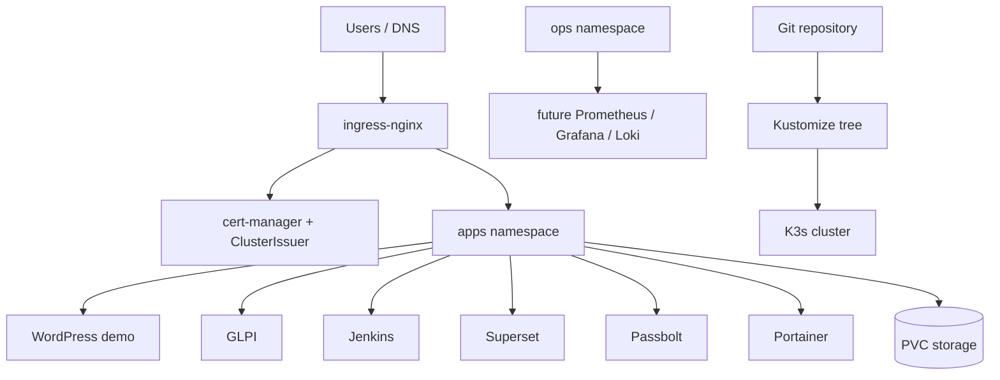

# ITO K3s Platform Lab

This repository is the Kubernetes/K3s evolution path for the ITO infrastructure. It is not a blind rewrite of the Docker Swarm platform. It is a controlled lab that keeps the same operational goals while moving the platform toward Kubernetes-native primitives: namespaces, Ingress, cert-manager, NetworkPolicy, PVCs, probes, GitOps-friendly manifests, and repeatable runbooks.

The repository is presentation-ready and sanitized. It contains no real production secrets, no private kubeconfig, no certificate private keys, and no environment file.

## Why This Exists

The current infrastructure has two historical phases:

1. `ito-traefik-swarm-infra` - Docker Swarm application stacks exposed dynamically through Traefik.
2. `ito-nginx-swarm-edge` - Nginx as a controlled, static Swarm edge with explicit routes and TLS automation.

This repository models the next possible phase:

3. `ito-k3s-platform-lab` - a K3s architecture that keeps operational control while introducing Kubernetes standards.

The goal is not to claim Kubernetes is always better. The goal is to document a serious migration path that would make sense if ITO needs stronger standardization, GitOps workflows, RBAC, namespaces, health probes, ingress controllers, and portability to platforms such as GKE.

## Architecture



## Repository Layout

| Path | Purpose |
| --- | --- |
| `kustomization.yaml` | Default Kustomize entrypoint for the lab cluster. |
| `clusters/ito-lab/` | Cluster notes and future overlay location. |
| `platform/` | Shared cluster platform objects: namespaces, storage, ingress values, cert-manager values. |
| `apps/` | Kubernetes templates for services that exist in the Swarm platform. |
| `policies/` | NetworkPolicy baseline and namespace isolation. |
| `scripts/` | Bootstrap, add-on install, secret creation, apply, validation. |
| `docs/` | Architecture, operations, migration, and security documentation. |
| `runbooks/` | Concrete incident and maintenance procedures. |

## Quick Start

Copy the environment template:

```bash
cp .env.example .env
```

Edit `.env` with lab values, then bootstrap in order:

```bash
make bootstrap
make addons
make secrets
make apply
make validate
```

For an existing K3s cluster, skip `make bootstrap` and use:

```bash
export KUBECONFIG=/path/to/kubeconfig
make addons
make secrets
make apply
```

## Deployment Model

This repo deliberately uses simple, inspectable primitives:

- K3s for the Kubernetes distribution.
- ingress-nginx as the edge controller.
- cert-manager for ACME certificates.
- Kustomize for repository-native composition.
- PVCs for stateful services in the lab.
- Secrets created from local `.env`, not committed.
- NetworkPolicy baseline for namespace isolation.

This keeps the lab understandable while still being close to production Kubernetes.

## Operational Position

The proposed production posture would be progressive:

1. Keep Nginx + Swarm stable for current services.
2. Use this repo as a lab for K3s and Kubernetes concepts.
3. Migrate one stateless service first.
4. Add GitOps after manifests stabilize.
5. Move stateful services only after backup and restore procedures are proven.

See [docs/MIGRATION.md](docs/MIGRATION.md) for the full analysis.

## Documentation

- [Architecture](docs/ARCHITECTURE.md)
- [Operations](docs/OPERATIONS.md)
- [Security](docs/SECURITY.md)
- [Migration Strategy](docs/MIGRATION.md)
- [Application Mapping](docs/APP_MAPPING.md)
- [Architecture Decisions](docs/DECISIONS.md)
- [GitOps Model](docs/GITOPS.md)
- [Production Readiness](docs/PRODUCTION_READINESS.md)
- [Validation Guide](docs/VALIDATION.md)
- [Diagram Source](docs/diagrams.mmd)
- [Runbooks](runbooks/README.md)

## Important Safety Notes

- Do not commit `.env`.
- Do not commit kubeconfig files.
- Do not commit generated TLS material.
- Use `letsencrypt-staging` until DNS and Ingress behavior are validated.
- Treat stateful services as experiments until restore tests pass.
- The manifests are a strong lab baseline. Before production, pin image tags, replace example domains, externalize secrets, and prove backups.
