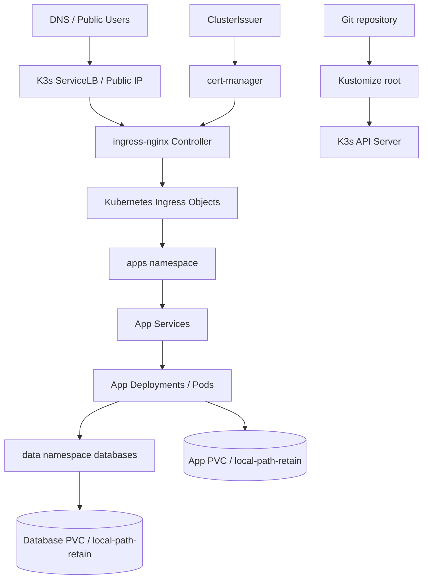

# Architecture

## Executive Summary

This repository defines a production-oriented K3s platform for ITO servers. It keeps the operational control of a small VPS-style deployment while adopting Kubernetes primitives that are useful in production: Deployments, Services, Ingress, Secrets, PVCs, probes, NetworkPolicy, Pod Security Admission labels, resource guardrails, and Git-friendly desired state.

## Target Model



## Namespace Design

| Namespace | Responsibility | Why it exists |
| --- | --- | --- |
| `ingress-nginx` | Helm-managed ingress controller | Public HTTP/S entry layer. |
| `cert-manager` | Helm-managed certificate controller | ACME automation and certificate lifecycle. |
| `apps` | Application workloads | Holds app frontends, admin tools, app PVCs, and backup CronJobs. |
| `data` | Database workloads | Holds WordPress MySQL and Passbolt MariaDB Deployments, Services, and PVCs. |
| `ops` | Operations and observability | Holds platform settings, Prometheus, Alertmanager, Grafana, Loki, and cluster-state collectors. |
| `node-observability` | Node-level observability | Holds hostPath collectors such as Promtail and node-exporter. |
| `edge` | Future edge helpers | Reserved for custom edge tools if the architecture grows. |

## Ingress Strategy

K3s is installed with bundled Traefik disabled and ingress-nginx installed by Helm. This keeps the edge explicit and familiar for operators coming from Nginx-based server routing.

The Ingress model replaces Nginx `server{}` blocks with Kubernetes `Ingress` resources:

| Nginx concept | Kubernetes equivalent |
| --- | --- |
| `server_name` | `spec.rules[].host` |
| `proxy_pass` | `Service` backend |
| Certbot webroot | cert-manager HTTP-01 solver |
| auth include | ingress annotations, external auth, VPN, or app auth |
| rate-limit include | ingress-nginx rate-limit annotations |
| security headers | ingress-nginx config, app headers, or policy |

Public hostnames and the selected cert-manager issuer are centralized in `platform/settings.yaml` and injected by Kustomize replacements.

## TLS Strategy

cert-manager owns certificate lifecycle. The repository defines:

- `letsencrypt-staging` for validation.
- `letsencrypt-production` for real public certificates.

The selected issuer comes from `platform/settings.yaml`. The default is `letsencrypt-staging` for safe first applies. Change it to `letsencrypt-production` before real cutover after DNS and HTTP-01 routing are proven.

## Storage Strategy

The default StorageClass is `local-path-retain`:

```yaml
reclaimPolicy: Retain
volumeBindingMode: WaitForFirstConsumer
allowVolumeExpansion: true
```

This is acceptable for a small single-server K3s deployment when the operator accepts node-local storage risk and has external backups. The repo includes Restic CronJobs for off-node database and PVC backups. For stronger production resilience, also evaluate:

- Longhorn for replicated block storage.
- managed databases outside the cluster.
- Velero snapshots for cluster-level restore.

## Network Policy Strategy

The network model is default-deny for ingress and egress in `apps` and `data`.

Allowed traffic is specific:

- ingress-nginx reaches only frontend pods on their published ports.
- app frontends in `apps` reach only their matching database pods in `data` on TCP 3306.
- pods reach kube-dns on TCP/UDP 53.
- selected apps reach public web endpoints on TCP 80/443.
- selected apps reach SMTP endpoints on TCP 25/465/587.
- backup jobs in `apps` reach their database targets in `data` and S3-compatible HTTPS endpoints.
- Jenkins reaches Git SSH on TCP 22.
- labelled Jenkins agents reach Jenkins TCP 50000.

There is no namespace-wide internal allow.

## Application Mapping

| Service | K3s object set |
| --- | --- |
| WordPress | App Deployment in `apps`, MySQL Deployment in `data`, Services, Ingress, PVCs |
| Jenkins | Deployment, Service, Ingress, PVC |
| GLPI | Deployment, Service, Ingress, PVC |
| Superset | Deployment, Service, Ingress, PVC |
| Passbolt | Passbolt Deployment in `apps`, MariaDB Deployment in `data`, Services, Ingress, PVCs |
| Portainer | Deployment, Service, Ingress, PVC |

## Production Upgrade Path

The next architectural upgrades are:

- restore automation for the remaining stateful apps.
- ingress external auth for admin surfaces.
- CI checks with kubeconform and policy-as-code.
- per-server overlays if the same repo manages staging and production.
- Cilium if FQDN egress enforcement becomes mandatory.
