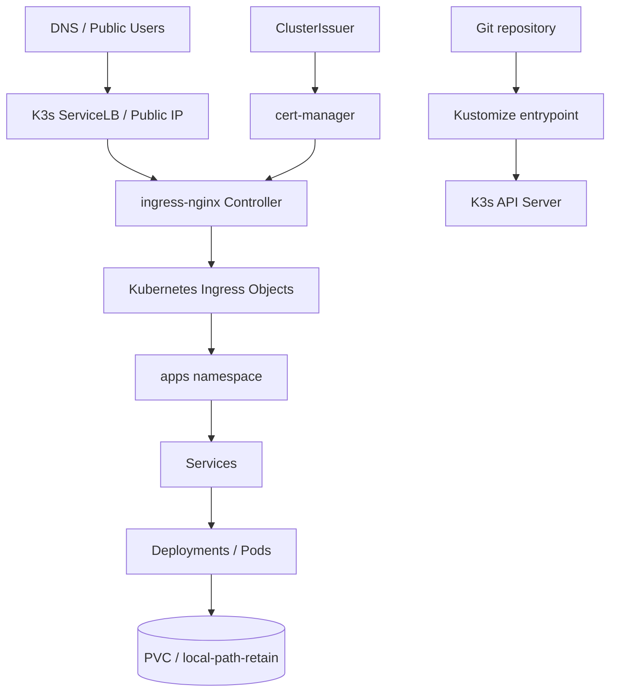

# Architecture

## Executive Summary

This repository proposes a K3s platform as the next maturity step after the Docker Swarm infrastructure. The current Swarm platform is simple and appropriate for a constrained VPS. K3s becomes valuable when the platform needs stronger standardization: Kubernetes Deployments, Services, Ingress, Secrets, ConfigMaps, PVCs, probes, RBAC, NetworkPolicy, and GitOps-friendly manifests.

The architecture is intentionally progressive. It does not assume that every service should be migrated immediately. It creates a lab that can validate Kubernetes behavior before any production cutover.

## Target Model



## Namespace Design

| Namespace | Responsibility | Why it exists |
| --- | --- | --- |
| `ingress-nginx` | Helm-managed ingress controller | Public HTTP/S entry layer. |
| `cert-manager` | Helm-managed certificate controller | ACME automation and certificate lifecycle. |
| `apps` | Application workloads | Keeps business workloads separate from controllers. |
| `data` | Future dedicated database workloads | Reserved for stricter data isolation when stateful migration begins. |
| `ops` | Future observability stack | Reserved for Prometheus, Grafana, Loki, and alerts. |
| `edge` | Future edge helpers | Reserved for custom edge tools if the architecture grows. |

## Ingress Strategy

The lab disables K3s' bundled Traefik and installs `ingress-nginx`. This choice mirrors the Swarm Nginx migration: explicit behavior, strong operational visibility, standard annotations, and an ecosystem that maps cleanly to production Kubernetes.

The Ingress model replaces Nginx `server{}` blocks with Kubernetes `Ingress` resources:

| Swarm Nginx concept | K3s equivalent |
| --- | --- |
| `server_name` | `spec.rules[].host` |
| `proxy_pass` | `Service` backend |
| Certbot webroot | cert-manager HTTP-01 solver |
| `auth-infra.conf` | ingress annotations or external auth |
| `ratelimit-infra.conf` | ingress-nginx rate-limit annotations |
| `security-headers.conf` | ingress-nginx config / app headers / policy |

## TLS Strategy

cert-manager is responsible for certificate lifecycle. The repository defines two ClusterIssuers:

- `letsencrypt-staging` for safe validation.
- `letsencrypt-production` for real public certificates after DNS is correct.

The default manifests use staging. Production should be enabled only after:

1. DNS points to the cluster public IP.
2. ingress-nginx serves HTTP-01 challenge paths.
3. staging certificate issuance succeeds.
4. `kubectl describe certificate` shows no solver errors.

## Storage Strategy

The lab uses K3s' `local-path` provisioner through a retained StorageClass:

```yaml
reclaimPolicy: Retain
volumeBindingMode: WaitForFirstConsumer
allowVolumeExpansion: true
```

This is good for a single-node lab because it is simple and transparent. It is not enough for a production multi-node architecture unless the risk is accepted. For production, evaluate:

- Longhorn for replicated block storage.
- managed databases outside the cluster.
- external object storage for backups.
- Velero or restic-based volume backups.

## Network Policy Strategy

The lab includes a default-deny baseline for `apps` and `data`, then allows:

- ingress controller traffic into app ports.
- internal traffic inside the `apps` namespace for service-to-service communication.

This is intentionally stricter than default Kubernetes networking. It creates the right habit early: services should be reachable because policy allows it, not because the cluster is wide open.

## Application Mapping

| Current Swarm service | K3s lab object |
| --- | --- |
| WordPress stack | `apps/wordpress-demo` Deployment, MySQL, Service, Ingress, PVCs |
| Jenkins | `apps/jenkins` Deployment, Service, Ingress, PVC |
| GLPI | `apps/glpi` Deployment, Service, Ingress, PVC |
| Superset | `apps/superset` Deployment, Service, Ingress, PVC |
| Passbolt | `apps/passbolt` Passbolt + MariaDB, Service, Ingress, PVCs |
| Portainer | `apps/portainer` Deployment, Service, Ingress, PVC |

## Production Upgrade Path

The lab is deliberately conservative. A stronger production design would add:

- GitOps controller such as Argo CD or Flux.
- Sealed Secrets, SOPS, or External Secrets.
- Prometheus, Grafana, Loki, Alertmanager.
- backup controller and restore drills.
- per-app NetworkPolicies instead of namespace-wide internal allow.
- PodDisruptionBudgets for services with more than one replica.
- resource requests and limits based on observed usage.
- image pinning instead of floating `latest` tags.

## Architecture Decision

K3s is the recommended first Kubernetes step because it is lightweight and close to upstream Kubernetes. It teaches the correct primitives without forcing the operational weight of a large managed cluster. It also leaves a future path to GKE if ITO needs cloud-managed control plane, node pools, autoscaling, or stronger load-balancing integration.
